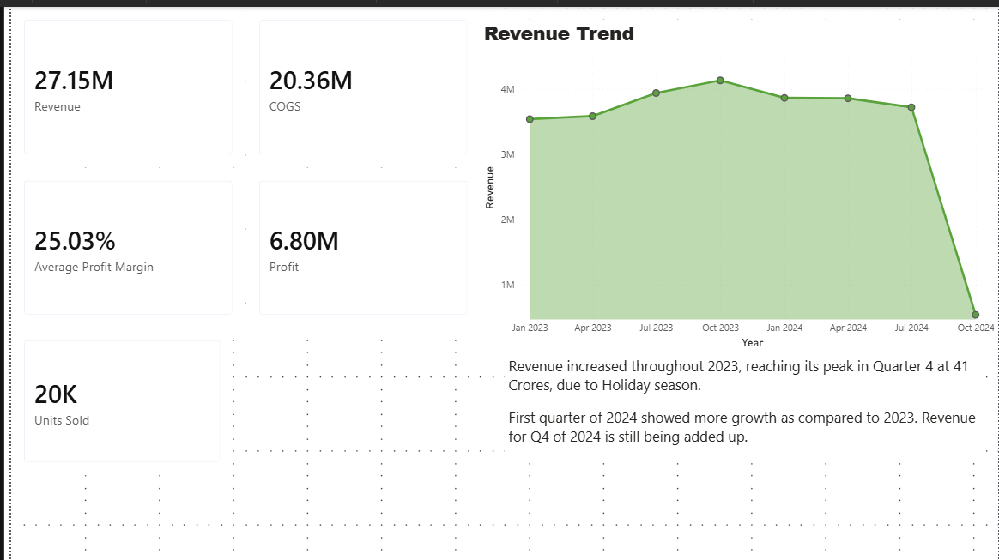
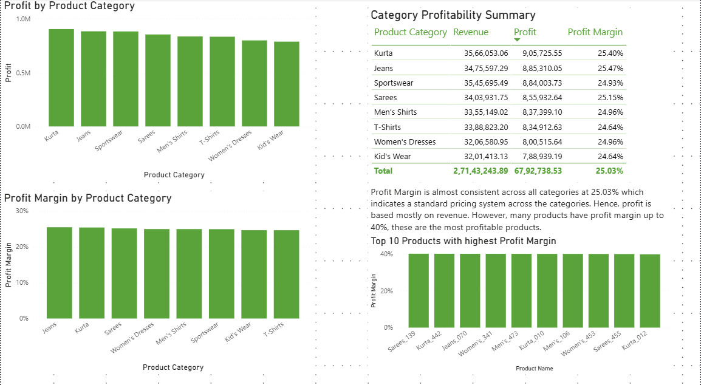
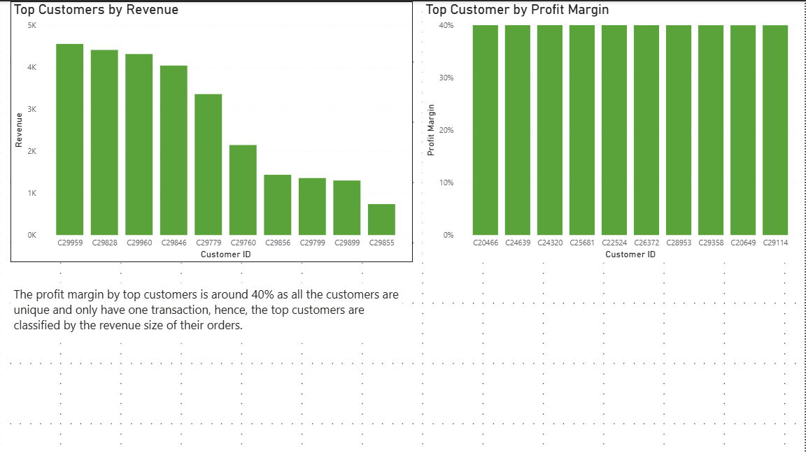
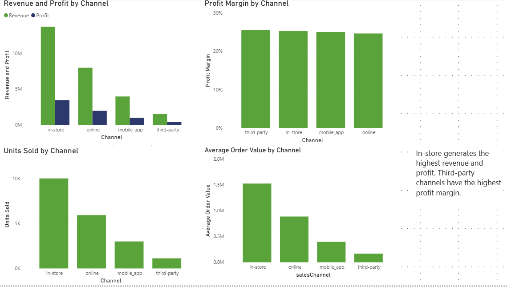

# Clothing Sales Data Analysis

This project analyzes clothing retail sales data to uncover trends in revenue, profitability, sales channels, and customer behavior.  
The goal is to simulate a real-world business analysis workflow using Python, SQL, and Power BI.

## Project Workflow

The project follows a typical data analytics pipeline:

1. **Data Cleaning** – Performed using Python in Google Colab
2. **Data Analysis** – SQL queries executed in PostgreSQL
3. **Data Visualization** – Interactive dashboard built in Power BI

## Dataset

The dataset contains clothing retail sales transactions including:

- Product category
- Sales channel
- Revenue and cost
- Profit
- Order quantity
- Sale date
- Order status (completed, returned, cancelled)

The raw dataset was cleaned to handle missing values, remove duplicates, and calculate profit metrics.

## Key Business Questions

The analysis focuses on answering the following questions:

- Which product categories generate the highest profit?
- How do returns and cancellations affect profitability?
- Which sales channels drive the most revenue and profit?
- What is the distribution of profit margins across categories?
- Are there seasonal trends in sales performance?
- Does customer revenue follow the Pareto principle (80/20 rule)?

## Key Insights

- Profit margins are relatively consistent across categories (~25%), but returns significantly reduce realized profit.
- Return rates across product categories range from approximately **37–41%**, impacting profitability.
- **In-store sales generate the highest overall revenue**, followed by online channels.
- Average order values remain similar across channels, suggesting pricing consistency.
- Sales show **seasonal growth toward the end of the year**, indicating stronger Q4 performance.
- Pareto analysis shows that traditional 80/20 customer concentration is limited because **most customers purchase only once**.

## Dashboard Preview

### Overall Dashboard

### Product Category Performance

### Customer Performance

### Channel Performance

## Repository Structure
data/
raw-sales-data.csv
cleaned-sales-data.csv

notebooks/
data_cleaning.ipynb

sql/
analysis_queries.sql

dashboard/
retail-clothing-analysis-dashboard.pbix

images/
executive-overview.png
product-profitability.png
customer-insight.png
channel-insight.png

## Tools Used

- Python (Pandas) – Data cleaning  
- PostgreSQL – Data analysis  
- Power BI – Dashboard visualization  
- GitHub – Project version control
